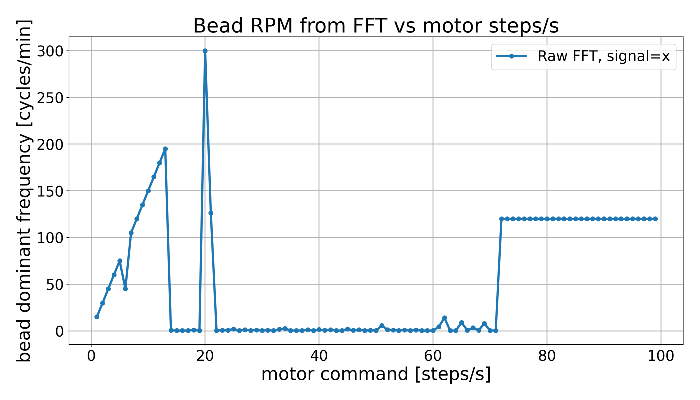
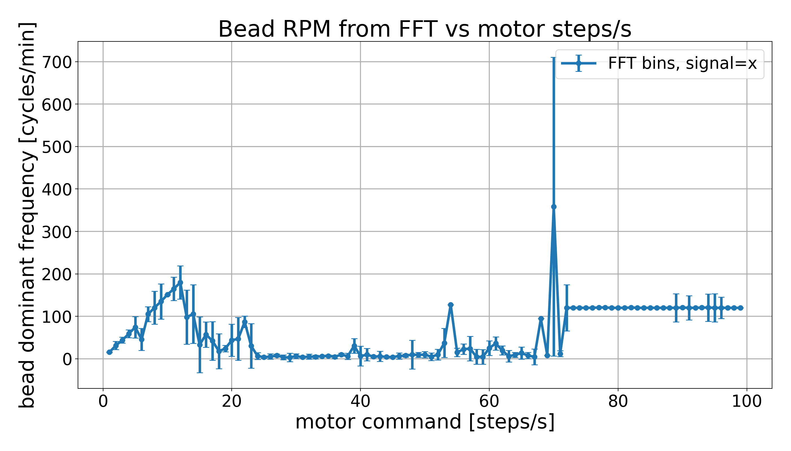

# Pipeline per mappare gli RPM della bilia ai RPM dello statore

**Date**: 27 Maggio 2026

### Setup
* Bead diameter: 4.5 mm
* Work bench: Petri dish libero (no barriers)
* Fluid: Acqua, sommergere la bilia completamente

### Acquisition

[`mapping_RPM.py`](mapping_RPM.py) keeps the Arduino, camera, and optional remote
viewer open for the complete speed sweep. A fresh MOG2 model and trajectory are
created for each speed condition without reopening the camera.

Run a short remote test first:

```bash
uv run python pipelines/Mapping_RPM_pipeline/mapping_RPM.py \
  --speeds 5 10 \
  --duration 10 \
  --settle 2 \
  --display remote
```

Use the SSH tunnel described in the project README and open
`http://127.0.0.1:8765` on MASTER. The remote stop button aborts the sweep while
preserving completed runs. The pipeline always attempts to send `STOP` before
closing Arduino; use `--stop-command 9999` with the legacy May firmware.

Outputs use the shared `<speed>_RPM.csv` convention, including decimal speeds
such as `1.5_RPM.csv`. Valid existing runs are skipped by default so an
interrupted sweep can be resumed. Pass `--overwrite` to record every condition
again. `mapping_status.csv` is replaced atomically after each condition, and
individual tracking CSVs are written through a temporary file before becoming
visible.

Do not run another camera script at the same time; camera ownership remains an
operator responsibility.

### Analysis

Analyze the recorded directory directly:

```bash
uv run python pipelines/Mapping_RPM_pipeline/automatic_produce.py \
  --data-dir data/processed/mapping_RPM
```

Both batch and single-file analysis accept integer and decimal speed filenames.

### Data
The default acquisition directory is `data/processed/mapping_RPM`.

## Results




